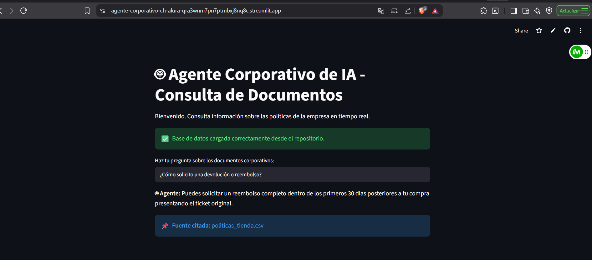
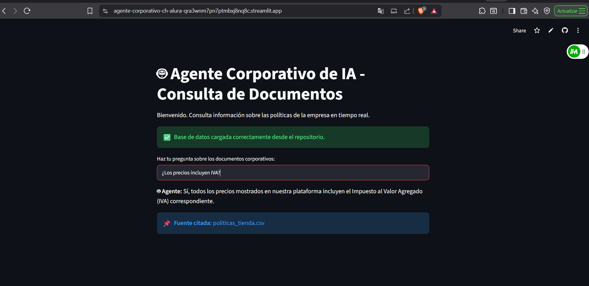

# 🤖 **Agente Corporativo de Inteligencia Artificial - Challenge Alura Latam**

Proyecto diseñado como un **Agente Inteligente Corporativo** capaz de procesar documentos internos y responder consultas en lenguaje natural utilizando la arquitectura **RAG (Retrieval-Augmented Generation)**. Ofrece respuestas rápidas y confiables con citación de fuentes para la toma de decisiones.

Este desafío forma parte del programa **Oracle Next Education (ONE) - Alura Latam**.

🌐 **Prueba la aplicación en vivo:** [Agente Corporativo en Streamlit Cloud](https://agente-corporativo-ch-alura-qra3wnm7pn7ptmbxj8nq8c.streamlit.app/)

---

### 🚀 **Funcionalidades Principales**

* **Ingesta de Documentos:** Procesamiento de políticas en formato estructurado (`politicas_tienda.csv`).
* **Capa de Recuperación RAG:** Búsqueda semántica para localizar la respuesta exacta.
* **Citación de Fuentes:** Transparencia indicando el origen del dato en cada respuesta.
* **Control de Alucinaciones:** Mensaje de reserva cuando la consulta no existe en la base de conocimiento.
* **Interfaz Conversacional:** Chat ágil e interactivo desarrollado en Streamlit.

---

### 📸 **Evidencia de Ejecución**




---

### 🛠️ **Arquitectura y Tecnologías**

* **Lenguaje:** Python 3.11 🐍
* **Modelo LLM:** Google Gemini API (`gemini-1.5-flash`)
* **Interfaz de Usuario:** Streamlit 🎈
* **Despliegue Cloud:** Streamlit Community Cloud ☁️
* **Control de Versiones:** Git & GitHub 🐙

---

### 💻 **Ejecución Local**

1. **Clonar el repositorio:**
   ```bash
   git clone [https://github.com/Jebareiro/agente-corporativo-ch-alura.git](https://github.com/Jebareiro/agente-corporativo-ch-alura.git)
   cd agente-corporativo-ch-alura

